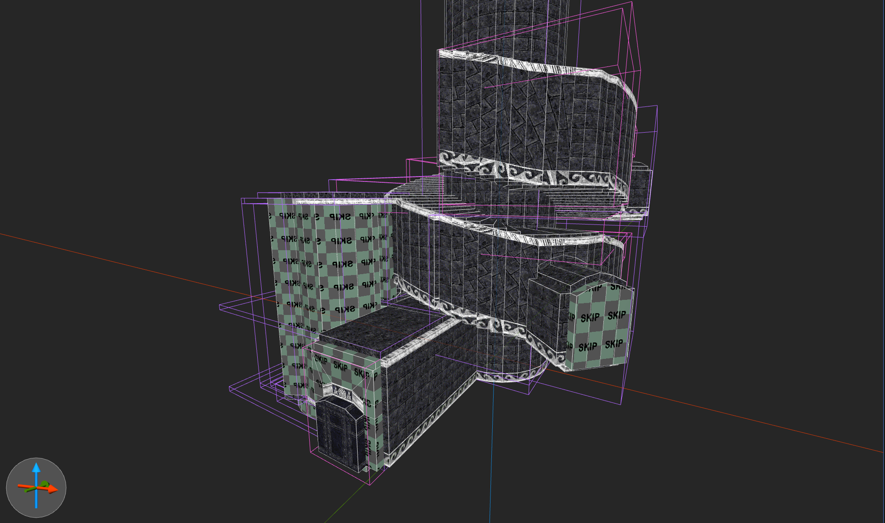
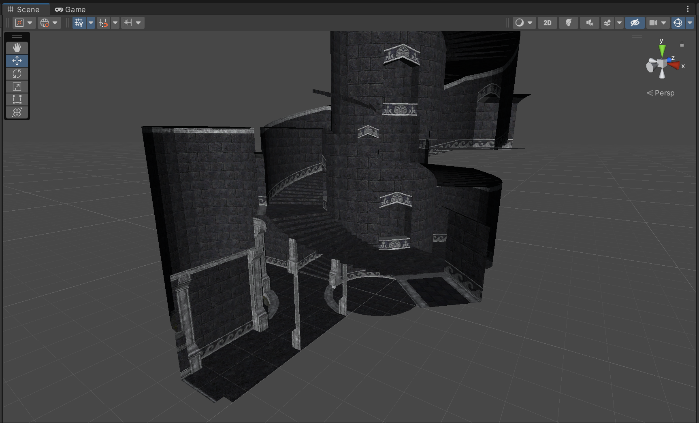

# Unity-BSP-Loader
## About
This is a newer version of my old [Unity-BSP-Loader](https://github.com/Dataram57/Unity/tree/main/Tools/BSPLoader). As same as previously, this tool is made to make mapping for unity become easy. So this tool is not designed to just simply import your Quake map, but it can be used as such.
## Mapping workflow
1. You make your map in your special level-editor (Currently preferable is Trenchbroom).
2. Your map file is being compiled into ".bsp" format.
3. Unity-BSP-Loader imports your level into your currently opened Unity scene.
## Mapping with Trenchbroom
If you are not already familiar with this program, and you don't have any alternative tool in mind to create your Quake-like level, then it would be good for you to start using Trenchbroom. Tutorial is [here](https://youtu.be/gONePWocbqA).

Also if you don't want to buy the original Quake game to test your map, then you can use a free and legal Quake-like game called [LibreQuake](https://github.com/MissLav/LibreQuake). Or you may find a legal Quake1 demo... somewhere...
## Co-operate with Trenchbroom
To improve your mapping productivity, it would be good if you wouldn't have to switch between many windows. That's why it is preferable to replace your current compiling BSP GUI window with inside Trenchbroom tools/scripts. To compile your map you will need programs such as "qbsp" and "vis". You can download them, for example [here](https://ericwa.github.io/ericw-tools/), but it is up to you which one you will use.

When you will have these tools on your PC, you will have let the trenchbroom know how to access them. To do that, go to `Preferences/Quake` and fill the `qbsp` and `vis` properties with a path to your selected executable. DumptruckDS also tells about doing that in his [TrenchBroom Mapping Tutorial](https://youtu.be/gONePWocbqA).

When you will have `qbsp` and `vis` defined in `Preferences/Quake`, you will have to create a Profile to compile your map. To do this, go to `Run/Compile Map...` and in the `Profiles` panel (left panel), click on a plus icon. That's how you create profiles in TrenchBroom. After doing this you will have to fill this profiles with such example configuration: 

	Name: Unity for Quake BSP Compilation
	Working Directory: ${MAP_DIR_PATH}
	Instructions:
	    Export Map:
		    Target: ${MAP_DIR_PATH}
	    Run Tool:
		    Target: ${qbsp}
		    Parameters: "${WORK_DIR_PATH}/${MAP_BASE_NAME}-compile.map" "${WORK_DIR_PATH}/${MAP_BASE_NAME}.bsp" -bsp2 -subdivide 1024
	    Run Tool:
		    Target: ${vis}
			Parameters: "${WORK_DIR_PATH}/${MAP_BASE_NAME}.bsp"
This is a configuration that I like to use, but if you have better tools and like to add some changes to it, go ahead. Just make sure that in the end your compiled map will be in your easy to navigate directory (Like your map directory).

By clicking on Compile your map will be compiled to a `.bsp` file, which is a quake map format, that has no useless, invisible to player faces. But to make this compiling proccess even more faster, I would really reccomend you binding a specific combination keys like `CTRL + [`, to launch a `Compile Map...` window. Go to `Preferences/Keyboard/` and search for `Run > Compile Map...`.
## Installing Unity BSP importer
gonna write later... going on a trip...

Some pictures:

